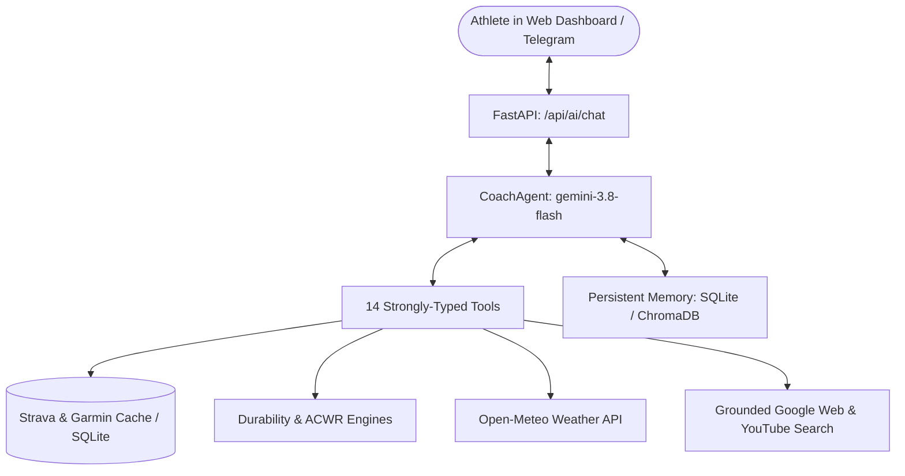

# 🤖 StaminAI Coach & Conversational Agent

StaminAI features an intelligent AI coaching architecture powered by Google Gemini, combining:
1. **One-shot Weekly Analysis** (`POST /api/ai/coach`): Heuristic and LLM evaluation of weekly volume, ACWR readiness, and multi-sport balance.
2. **Conversational StaminAI Coach** (`POST /api/ai/chat`): A persistent, tool-augmented chat agent accessible via the 💬 floating drawer in the web dashboard.

---

## 🏗️ Architecture

The conversational coach is built on `google-genai` with automatic function calling (`automatic_function_calling=True`), accessing 14 typed backend tools.

---

## 🛠️ The 14 Agent Tools

The agent intelligently decides which tools to invoke based on user prompts. All numeric tools route through `src.formatting.corrected_distance_and_speed` so that numbers in the chat always match the dashboard and Google Sheet:

| Tool | Purpose & Example Query |
| --- | --- |
| `get_week_summary` | Returns volume, hours, activities, and effort for any specified week. *"How was my training this week?"* |
| `get_activities` | Queries recent activities with optional sport filter and count. *"What did I run last month?"* |
| `get_training_load` | Fetches acute:chronic workload ratio (ACWR), chronic baseline, and fatigue zone. *"Is my training load safe?"* |
| `get_run_durability` | Computes ramp rate, spacing, monotony, strain, and composite injury risk. *"Am I risking a running injury?"* |
| `get_race_projections` | Computes 5K, 10K, half marathon, and triathlon time predictions (PB or training mode). *"What can I run a half in?"* |
| `get_health_metrics` | Returns multi-week sleep, resting heart rate, and overnight HRV trends. *"Show my sleep and HRV trends."* |
| `get_athlete_recovery` | Evaluates same-day readiness based on sleep duration, RHR, HRV, and Body Battery. *"How recovered am I today?"* |
| `get_gear_status` | Returns shoe mileage, replacement warnings, and bike equipment usage. *"Check my running shoe wear."* |
| `get_workout_compliance` | Evaluates plan vs. actual execution and scores target adherence (0-100%). *"Did I hit my intervals on Tuesday?"* |
| `preview_next_workout` | Reads tomorrow's prescribed workout from Google Sheets with weather adjustments. *"What is planned for tomorrow?"* |
| `get_weather_forecast` | Returns Athens daily forecast, rain chance, and wind speed. *"What is the weather tomorrow morning?"* |
| `search_web` | Performs grounded search for races, registration dates, courses, or gear specs. *"Find half marathons near Athens in November."* |
| `find_exercise_videos` | Searches YouTube for specific strength, mobility, or drill demonstrations. *"Show me single-leg Romanian deadlift form."* |
| `remember_fact` | Saves a durable fact about the athlete (injuries, preferences, goals) into persistent memory. |

> [!NOTE]
> Web searches use a dedicated grounded search call rather than mixing search with tool declarations in a single payload, ensuring reliable execution across Gemini API versions.

---

## 🧠 Long-Term Persistent Memory

Conversation history and recalled facts persist across server reloads and browser sessions.

### Memory Backends
Configurable via `COACH_MEMORY_BACKEND`:

1. **`sqlite` (Default)**:
   - Uses local SQLite database (`.training_history.db`).
   - Keyword-overlap matching (`_words`).
   - Zero additional network calls or API costs.
2. **`chroma`**:
   - Uses ChromaDB (`.coach_memory/`).
   - Semantic vector embeddings via `gemini-embedding-001`.
   - Recalls facts based on conceptual meaning.

### Inspecting & Pruning Memory
Athletes have full transparency over what the AI coach remembers:
- Open the 🧠 **Memory** tab inside the web drawer.
- View all stored facts with IDs and timestamps.
- Delete outdated or incorrect facts with one click (`DELETE /api/coach/memory/{id}`).
- Trigger end-of-session auto-extraction via `POST /api/coach/memory/extract`.

---

## ⚕️ Non-Diagnostic Injury Scope & Safety

To protect the athlete's physical health, StaminAI enforces strict safety boundaries:
1. **System Prompt Constraint**: The AI Coach is instructed that it is an endurance performance assistant, not a doctor or physiotherapist. It never provides definitive medical diagnoses or advises running through sharp/acute pain.
2. **Deterministic Server-Side Disclaimer**: If an athlete asks about pain, injury, Achilles soreness, shin splints, or plantar fasciitis, the server automatically appends a formal non-diagnostic disclaimer and physio referral at the API boundary, regardless of model output.
